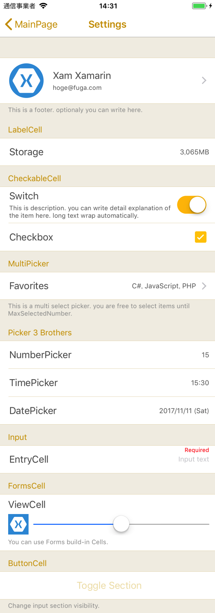
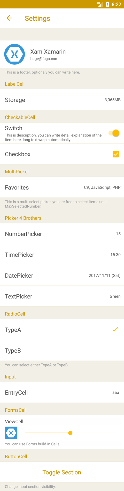
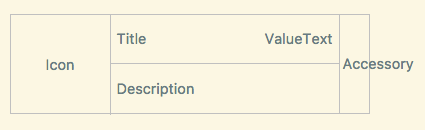

# SettingsView for Xamarin.Forms

This is a flexible TableView specialized in settings for Android / iOS.

[Japanese](./README-ja.md)


## What SettingsView can do.

### General

* To set separator color.
* To set selected cell color.
* To scroll to screen top and bottom.

### Sections

* To set IsVisible each section.
* To set section a footer.
* To set various options of a header and  a footer.
* To set Forms View to a section header and footer.
* To use DataTemplate and DataTemplateSelector in a section.
* To reorder items by drag and drop in a section.

### Cells

* To set options of all the cells as SettingsView options at once.
* To set indivisual cell options. (indivisual cell options  is superior to SettingsView options.)
* To set a cell HintText.
* To use an icon  cached in memory at all cells.
* To change corner radius of an icon.
* To use various defined cells.
* To use Xamarin.Forms.ViewCell and the others.


 

### Demo movie

[https://youtu.be/FTMOqNILxBE](https://youtu.be/FTMOqNILxBE)

## Minimum Device and Version etc

iOS:iPhone5s,iPod touch6,iOS9.3  
Android:version 5.1.1 (only FormsAppcompatActivity) / API22

## Nuget Installation

[https://www.nuget.org/packages/AiForms.SettingsView/](https://www.nuget.org/packages/AiForms.SettingsView/)

```bash
Install-Package AiForms.SettingsView
```

You need to install this nuget package to .NETStandard project and each platform project.

### For iOS

AppDelegate.cs

```csharp
public override bool FinishedLaunching(UIApplication app, NSDictionary options) {
    global::Xamarin.Forms.Forms.Init();
    AiForms.Renderers.iOS.SettingsViewInit.Init(); //need to write here

    LoadApplication(new App());
    return base.FinishedLaunching(app, options);
}
```

### For Android

MainActivity.cs

```csharp
protected override void OnCreate(Bundle bundle)
{
    base.OnCreate(bundle);

    global::Xamarin.Forms.Forms.Init(this, bundle);
    AiForms.Renderers.Droid.SettingsViewInit.Init(); // need to write here
}
```

## How to write with xaml

```xml
<ContentPage 
	xmlns="http://xamarin.com/schemas/2014/forms" 
	xmlns:x="http://schemas.microsoft.com/winfx/2009/xaml" 
	xmlns:sv="clr-namespace:AiForms.Renderers;assembly=SettingsView"
	x:Class="Sample.Views.SettingsViewPage">
    
<sv:SettingsView HasUnevenRows="true">
    
    <sv:Section Title="Header1" FooterText="Footer1">
        <sv:CommandCell IconSource="icon.png" IconSize="60,60" IconRadius="30"
            Title="Xam Xamarin" Description="hoge@fuga.com"
            Command="{Binding ToProfileCommand}" CommandParameter="{Binding Parameter}"
            KeepSelectedUntilBack="true"            
        />
        <sv:ButtonCell Title="Toggle Section" TitleColor="{StaticResource TitleTextColor}"
             TitleAlignment="Center" Command="{Binding SectionToggleCommand}" />
        <sv:LabelCell Title="Label" ValueText="value" />
        <sv:SwitchCell Title="Switch" On="true" 
            Description="This is description." />
        <sv:CheckboxCell Title="Checkbox" Checked="true" />
    </sv:Section>

    <sv:Section Title="Header2" FooterText="Footer2" IsVisible="{Binding SctionIsVisible}">
        <sv:PickerCell Title="Favorites" ItemsSource="{Binding ItemsSource}" DisplayMember="Name" MaxSelectedNumber="3" 
        SelectedItems="{Binding SelectedItems}" KeepSelectedUntilBack="true" PageTitle="select 3 items" />
        <sv:NumberPickerCell Title="NumberPicker" Min="0" Max="99" Number="15" PickerTitle="Select number" />
        <sv:TimePickerCell Title="TimePicker" Format="HH:mm" Time="15:30" PickerTitle="Select time" />
        <sv:DatePickerCell Title="DatePicker" Format="yyyy/MM/dd (ddd)" Date="2017/11/11" MinimumDate="2015/1/1" MaximumDate="2018/12/15" TodayText="Today's date"/>
        <sv:EntryCell Title="EntryCell" ValueText="{Binding InputText.Value}" Placeholder="Input text" Keyboard="Email" TextAlignment="End" HintText="{Binding InputError.Value}" />
    </sv:Section>
    
</sv:SettingsView>
</ContentPage>
```

SettingsView properties settings may as well be witten in App.xaml. 
For example...

```xml
<Application xmlns="http://xamarin.com/schemas/2014/forms"
             xmlns:x="http://schemas.microsoft.com/winfx/2009/xaml"
             xmlns:sv="clr-namespace:AiForms.Renderers;assembly=SettingsView"
             x:Class="Sample.App">
    <Application.Resources>
        <ResourceDictionary>
            <Color x:Key="AccentColor">#FFBF00</Color>
            <Color x:Key="DisabledColor">#E6DAB9</Color>
            <Color x:Key="TitleTextColor">#CC9900</Color>
            <Color x:Key="PaleBackColorPrimary">#F2EFE6</Color>
            <Color x:Key="PaleBackColorSecondary">#F2EDDA</Color>
            <Color x:Key="DeepTextColor">#555555</Color>
            <Color x:Key="NormalTextColor">#666666</Color>
            <Color x:Key="PaleTextColor">#999999</Color>
            <x:Double x:Key="BaseFontSize">12</x:Double>
            <x:Double x:Key="BaseFontSize+">14</x:Double>
            <x:Double x:Key="BaseFontSize++">17</x:Double>
            <x:Double x:Key="BaseFontSize-">11</x:Double>

            <Style TargetType="sv:SettingsView">
                <Setter Property="SeparatorColor" Value="{StaticResource DisabledColor}" />
                <Setter Property="BackgroundColor" Value="{StaticResource PaleBackColorPrimary}" />
                <Setter Property="HeaderBackgroundColor" Value="{StaticResource PaleBackColorPrimary}" />
                <Setter Property="CellBackgroundColor" Value="{StaticResource AppBackground}" />
                <Setter Property="CellTitleColor" Value="{StaticResource DeepTextColor}" />
                <Setter Property="CellValueTextColor" Value="{StaticResource NormalTextColor}" />
                <Setter Property="CellTitleFontSize" Value="{StaticResource BaseFontSize++}" />
                <Setter Property="CellValueTextFontSize" Value="{StaticResource BaseFontSize}" />
                <Setter Property="CellDescriptionColor" Value="{StaticResource NormalTextColor}" />
                <Setter Property="CellDescriptionFontSize" Value="{StaticResource BaseFontSize-}" />
                <Setter Property="CellAccentColor" Value="{StaticResource AccentColor}" />
                <Setter Property="SelectedColor" Value="#50FFBF00" />
                <Setter Property="HeaderTextColor" Value="{StaticResource TitleTextColor}" />
                <Setter Property="FooterFontSize" Value="{StaticResource BaseFontSize-}" />
                <Setter Property="FooterTextColor" Value="{StaticResource PaleTextColor}" />
            </Style>
        </ResourceDictionary>
    </Application.Resources>
</Application>

```
Whereby any SettingsView in App will become the same property setttings.

## SettingsView Properties

* BackgroundColor
	* A color of out of region and entire region. They contains header, footer and cell (in case android).
* SeparatorColor
    * Row separator color.
* SelectedColor
    * Backgraound color when row is selected.
   > Note that cell's ripple effect is not worked on Android when the cell background color is not set.
* HeaderPadding
* HeaderTextColor
* HeaderFontSize
* HeaderFontFamily
* HeaderFontAttributes
* HeaderTextVerticalAlign
  > Note that this property is enabled only when specifying HeaderHeight.
* HeaderBackgroundColor
* HeaderHeight
    * They are section header options.
* FooterTextColor
* FooterFontSize
* FooterFontFamily
* FooterFontAttributes
* FooterBackgroundColor
* FooterPadding
    * They are section footer options.
* RowHeight
	* If HasUnevenRows is false, this value apply to each row height;
	* Otherwise this value is used as minimum row height. 
* HasUnevenRows
	* Whether row height is fixed. Default false.(recomend true)
* CellTitleColor
* CellTitleFontSize
* CellTitleFontFamily
* CellTitleFontAttributes
* CellValueTextColor
* CellValueTextFontSize
* CellValueTextFontFamily
* CellValueTextFontAttributes
* CellDescriptionColor
* CellDescriptionFontSize
* CellDescriptionFontFamily
* CellDescriptionFontAttributes
* CellBackgroundColor
* CellIconSize
* CellIconRadius
* CellAccentColor
* CellHintTextColor
* CellHintFontSize
* CellHintFontFamily
* CellHintFontAttributes
    * They are bulk cell options.
* UseDescriptionAsValue (for Android)
	* Whether description field  is used as value field. (like general android app)
    * Default false
* ShowSectionTopBottomBorder (for Android)
	* Whether a separator is shown at section top and bottom. (like general android app)
    * Default true
* ShowArrowIndicatorForAndroid
  * Whether a right arrow icon is shown at the right side in a CommandCel and PickerCell on Android.
* ScrollToTop
* ScrollToBottom
	* When this property is set to true, the screen will be scrolled to first item position or last item position.
	* If scrolling has complete, it will be set to false automatically.
* VisibleContentHeight
    * The height of the visible content. This value allows SettingsView itself height to fit total cells height.
* ItemsSource
* ItemTemplate
    * A DataTemplate for entire SettingsView can be used.
* TemplateStartIndex
  * This is the index that starts inserting the template. The default value is 0. If a specified value is greater or equal than 1, the template is inserted from its position and the section inserted with XAML remains. You can insert the repeating data wherever you want to do.

### To fit SettingsView height to visible content

If SettingsView's total cells height is shorter than the parent view height, itself height can be fit total cells height as the following:

```xml
<sv:SettingsView x:Name="settings" HeightRequest="{Binding VisibleContentHeight,Source={x:Reference settings}}">
</sv:SettingsView>
```

### Sample of ItemsSource and ItemTemplate for a root

```csharp
public class SomeViewModel
{
    public List<MenuSection> ItemsSource {get;set;}

    public SomeViewModel()
    {
        ItemsSource = new List<MenuSection>{
            new new MenuSection("Select number",3){
                new MenuItem{Title = "3",Value=3},
                new MenuItem{Title = "4",Value=4},
            },
            new MenuSection("Select mode",1){
                new MenuItem{Title = "A",Value = 1},
                new MenuItem{Title = "B",Value = 2}
            }
        }
    }
}
public class MenuItem
{
    public string Title { get; set; }
    public int Value { get; set; }
}

public class MenuSection:List<MenuItem>
{
    public string SectionTitle { get; set; }
    public bool Selected { get;set; } // must implement INotifyPropertyChanged by some way

    public MenuSection(string title,int initalSelectedValue)
    {
        SectionTitle = title;
    }
}
```

```xml
<sv:SettingsView x:Name="Settings" ItemsSource="{Binding ItemsSource}">
    <sv:SettingsView.ItemTemplate>
        <DataTemplate>
            <sv:Section Title="{Binding SectionTitle}" ItemsSource="{Binding}" sv:RadioCell.SelectedValue="{Binding Selected}">
                <sv:Section.ItemTemplate>
                    <DataTemplate>
                        <sv:RadioCell Title="{Binding Title}" Value="{Binding Value}" />
                    </DataTemplate>
                </sv:Section.ItemTemplate>
            </sv:Section>
        </DataTemplate>
    </sv:SettingsView.ItemTemplate>
</sv:SettingsView>
```

## SettingsView Methods

* ClearCache (static)
	* Clear all memory cache.

## Section Properties

* Title
	* Section header text. The same as Xamarin.Forms.TableSection.
* FooterText
	* Section footer text.
* IsVisible
	* Whether the section is visibled.
* HeaderHeight
	* Individual section header height.
	* Superior to SettingsView HeaderHight.  
* ItemsSource
	* Specify the source of a DataTemplate.
* ItemTemplate
	 * Specify a DataTemplate.
* TemplateStartIndex
  * This is the index that starts inserting the template. The default value is 0. If a specified value is greater or equal than 1, the template is inserted from its position and cells inserted with XAML remains. You can insert the repeating data wherever you want to do.
* UseDragSort
	* Enable you to reorder cells in a section with drag and drop.
	* Items can move in sections that UseDragSort Property is true.
	* If iOS version is less than or equal to iOS10, the cells can be moved when grabbing the icon drawn three lines; Otherwise can be moved when doing long tap.
* HeaderView
* FooterView
  * Set a Forms View to Header or Footer.
  > Once these are set, Title or FooterText is disabled.
  > If HeaderView or FooterView is used, the cell height turns auto size.

### Example for Section HeaderView FooterView with XAML

```xml
<sv:Section>
    <sv:Section.HeaderView>
        <StackLayout>
            <Label Text="Header" />
        </StackLayout>
    </sv:Section.HeaderView>
    <sv:Section.FooterView>
        <Label Text="{Binding FooterText}" />
    </sv:Section.FooterView>
</sv:Section>
```

### How to use an ItemsSource and an ItemTemplate for a Section

```csharp
public class SomeModel
{
   // you should use a ObservableCollection if you use a dynamic list.
   public ObservableCollection<Option> Options {get;set;}
   public void SomeMethod()
   {
       Options = new ObservableCollection(GetServerData());
   }
}
public class Option
{
   public string Name {get;set;}
   public string Address {get;set;}
}
```

```xml
<sv:Section ItemsSource="{Binding Options}">
    <sv:Section.ItemTemplate>
        <DataTemplate>
            <sv:LabelCell Title="{Binding Name}" Value="{Binding Address}" />
        </DataTemplate>
    </sv:Section.ItemTemplate>
</sv:Section>
```

## Cells

* [CellBase](#cellbase)
* [LabelCell](#labelcell)
* [CommandCell](#commandcell)
* [ButtonCell](#buttoncell)
* [SwitchCell](#switchcell)
* [CheckboxCell](#checkboxcell)
* [RadioCell](#radiocell)
* [NumberPickerCell](#numberpickercell)
* [TimePickerCell](#timepickercell)
* [DatePickerCell](#datepickercell)
* [TextPickerCell](#textpickercell)
* [PickerCell](#pickercell)
* [EntryCell](#entrycell)
* [CustomCell](#customcell)

## CellBase

### Layout of cellbase



* Icon
    * If not specify a imagesource, icon will be hidden.
* Description
    * If not specify any text, description will be hidden.
* Accessory
    * Be used by a CheckboxCell and  a SwitchCell; Otherwise will be hidden. 

### Properties (all cell types)

* Title
    * Title text.
* TitleColor
    * Title text color.
* TitleFontSize
* TitleFontFamily
* TitleFontAttributes
    * Title text font size, family, attributes.
* Description
    * Description text.
* DescriptionColor
    * Description text color.
* DescriptionFontSize
* DescriptionFontSize
* DescriptionFontFamily
    * Description text font size, family, attributes.
* HintText
    * Hint text.(for some information, validation error and so on)
* HintTextColor
    * Hint text color.
* HintFontSize
* HintFontFamily
* HintFontAttributes
    * Hint text font size, family, attributes.
* BackgroundColor
    * Cell background color.
* IconSource
    * Icon image source. (any ImageSource object)
* IconSize
    * Icon size. (width,height)
* IconRadius
    * Icon corners radius.
* IsEnabled
	* Whether a cell is enabled. If set to false, the entire cell color will turn translucent and the cell won't accept any operations.

### To use SVG image

You can use SVG image if SvgImageSource is installed.

https://github.com/muak/SvgImageSource  
https://www.nuget.org/packages/Xamarin.Forms.Svg/

```bash
Install-Package Xamain.Forms.Svg -pre
```


## LabelCell

This is a cell showing read only text.

### Properties

* ValueText
    * Value text.
* ValueTextColor
    * Value text color.
* ValueTextFontSize
* ValueTextFontFamily
* ValueTextFontAttributes
    * Value text font size, family, attributes.
* IgnoreUseDescriptionAsValue
    * Whether ignore the setting that SettingsView property of UseDescriptionAsValue.

## CommandCell

This is a Labelcell invoked an action.

### Properties

* Command
    * Invoked action.
* CommandParameter
* KeepSelectedUntilBack
    * When moving next page, whether keep the cell selected until being back to the page.
* HideArrowIndicator
  * Hide a right arrow icon on the right side.
  * Even if ShowArrowIndicatorForAndroid is true, this property gives priority to.

The others are the same as LabelText.

## ButtonCell

This is a simple cell invoked an action like a button. 

### Properties

* TitleAlignment
    * Button title horizontal alignment.
* Command
* CommandParameter

This cell don't use Description property.

## SwitchCell

This is a LabelCell equipped a switch.

### Properties

* On
    * Switch toggle on / off. On is true, Off is false. 
* AccentColor
    * Swich accent color. (background color and so on)

## CheckboxCell

This is a LabelCell equipped a checkbox.

### Properties

* Checked
    * Check on / off. On is true, Off is false.
* AccentColor
    * Checkbox accent color. (frame and background)

## RadioCell

This is the cell that can be selected just one item from in a Section or a SettingsView.

### Properties

* Value
    * A value that can be selected.
* AccentColor
    * Check mark color.

### Attached Bindable Property

* SelectedValue
    * Current selected value.
    * If this property is set to a section, the item can be selected just one from the section, and if set to SettingsView itself, the item can be selected just one from entire SettingsView.
    > Note that this property can't be set to both entire and a section. If it is set to both, a section side is used.

### XAML Example

#### For a section

```xml
<sv:SettingsView>
    <sv:Section Title="Sound" sv:RadioCell.SelectedValue="{Binding SelectedItem}">
        <sv:RadioCell Title="Sound1" Value="{Binding Items[0]}">
        <sv:RadioCell Title="Sound2" Value="{Binding Items[1]}">
    </sv:Section>
</sv:SettingsView>
```

#### For global

```xml
<sv:SettingsView sv:RadioCell.SelectedValue="{Binding GlobalSelectedItem}">
    <sv:Section Title="Effect">
        <sv:RadioCell Title="Sound1" Value="{Binding Items[0]}">
        <sv:RadioCell Title="Sound2" Value="{Binding Items[1]}">
    </sv:Section>
    <sv:Section Title="Melody">
        <sv:RadioCell Title="Melody1" Value="{Binding Items[2]}">
        <sv:RadioCell Title="Melody2" Value="{Binding Items[3]}">
    </sv:Section>
</sv:SettingsView>
```

## NumberPickerCell

This is a LabelCell calling a number picker.

### Properties

* Number
    * Current number.(default two way binding)
* Min
    * Minimum number.
* Max
    * Maximum number.
* PickerTitle
    * Picker title text.
* SelectedCommand
    * A command invoked when a number is selected.

This cell can't use ValueText property.

## TimePickerCell

This is a LabelCell calling a time picker.

### Properties

* Time
    * Current time (default two way binding)
* Format
    * Time format. (for example "hh:mm")
* PickerTitle
    * Picker title text.

This cell can't use ValueText property.

## DatePickerCell

This is a LabelCell calling a date picker.

### Properties

* Date
    * Current date. (default two way binding)
* MinimumDate
* MaximumDate
* Format
    * Date format. (for example "ddd MMM d yyyy")
* TodayText
    * Text of the button selecting  today's date. (only iOS)
    * If this text is empty, the button will be hidden.

This cell can't use ValueText property.

## TextPickerCell

This is a LabelCell calling a text picker.

### Properties

* Items
	* Picker data source implementing IList.
	* This property can be set a list of built-in type. (e.g. List\<string>, List\<int>, List\<double>)
	* The result of ToString method is used as appearance text.
* SelectedItem
	* Selected item is set. (two-way binding)
* SelectedCommand
    * A command invoked when an item is selected.
* IsCircularPicker
    * Whether the picker items are circulated. (for Android) 
    * Default true

This cell can't use ValueText property.

## PickerCell

This is a LabelCell calling a multiple select picker.
When tapped on iOS, move next page and show picker there.
When tapped on Android, show the picker on a dialog. 

### Properties

* PageTitle
    * Picker page title text.
* ItemsSource
    * Picker data source implementing IEnumerable.
    * This have to assing a instance and must not null.
* DisplayMember
    * Class member(property) name Displayed on the picker.
* SubDisplayMember
	 * Class member(property) name secondary displayed on the Picker. If this property is set, the cell will be two line and the first line will display DisplayMember and the second line will display SubDisplayMember.
* SelectionMode
  * Whether SelectionMode is Single or Multiple. Default Multiple.
* SelectedItem
  * If SelectionMode is Single, a selected item assigned.
* SelectedItems
  * If SelectionMode is Multiple, selected items assigned.
  * IList where selected items is stored.
  * This have to assing a instance and must not null.
* SelectedItemsOrderKey
    * Class member(Property) name that becomes a order key when selected items is displayed  as text.
* SelectedCommand
	* A command invoked When finished being selected items. 
* MaxSelectedNumber
    * Selectable items number.
    * If zero, unlimited multi select mode. Else if One, single select mode. Otherwise limited multi select mode.
* KeepSelectedUntilBack
    * When moving next page or showing a dialog, whether keep the cell selected until being back to the page.
* AccentColor
    * Picker checkbox color.
* UseNaturalSort
	* Whether use NaturalSort as sort method. default false.
	* If true, for example, if  the order is normally  "1,10,2,3,4", is "1,2,3,4,10".
	* This option may not correctly work if not used Japanese language.
* UsePickToClose
	* Whether closing the Picker automatically if the number of selected items come to MaxSelectedNumber. 
* UseAutoValueText
	* Normally, selected items string is automatically displayed in the ValueText. If the value of this property is specified false, the auto display will be cleared and ValueText will be available as usual.

## EntryCell

This is a cell inputing some text.

### Properties

* ValueText
    * Input text. (default two way binding)
* ValueTextColor
    * Input text color.
* ValueTextFontSize
* ValueTextFontFamily
* ValueTextFontAttributes
    * Input text font size, family, attributes.
* MaxLength
    * Input text maximum length.
* Keyboard
    * Keyboard type.
* Placeholder
    * Placeholder text.
* PlaceholderColor
    * Placeholder color.
* TextAlignment
    * Input text horizontal alignment.
* AccentColor
    * Under line color on focus. (only android)
* IsPassword
    * Whether the input text is hidden or not for password.
* CompletedCommand
  * A command invoked When completing to input or losing the focus.

### Methods

* SetFocus
  * Set the EntryCell focus to show the soft keyboard.

## CustomCell

This is a cell that custom layout can be freely set in the center of Layout (blocks of the Title and ValueText and Description).
The forms view can be specified with XAML.

It is envisaged that makes use of subclass of CustomCell.

## Properties

* ShowArrowIndicator
  * Whether the arrow indicator is shown at the right side.
  * If true, the arrow is shown regardless of iOS and Android.
* IsSelectable
  * Whether a row can be selected. If true, the Command can be invoked.
* IsMeasureOnce
  * Whether a size calculation does just once. Default false.
  * If the height doesn't change depending on the cell contents, a size calculation can be omitted.
* UseFullSize
  * If true, the custom area uses full of the layout without paddings.
  > If this property is enabled, the icon settings turn disabled.
* Command
    * Invoked action.
* CommandParameter
* LongCommand
  * Long tap command action.
* KeepSelectedUntilBack
    * When moving next page, whether keep the cell selected until being back to the page.

### Example for CustomCell

* https://github.com/muak/AiForms.SettingsView/tree/development/Sample/Sample/Views/Cells
* https://github.com/muak/AiForms.SettingsView/blob/development/Sample/Sample/Views/CustomCellTest.xaml

## Contributors

* [codegrue](https://github.com/codegrue)
* [cpraehaus](https://github.com/cpraehaus)
* [dylanberry](https://github.com/dylanberry)

## Thanks 

* NaturalComparer
    * https://github.com/tomochan154/toy-box/blob/master/NaturalComparer.cs

## Donation

I am asking for your donation for continuous development🙇

Your donation will allow me to work harder and harder.

* [PayPalMe](https://paypal.me/kamusoftJP?locale.x=ja_JP)

## Sponsors

I am asking for sponsors too.
This is a subscription.

* [GitHub Sponsors](https://github.com/sponsors/muak)

## License

MIT Licensed.

[Material design icons](https://github.com/google/material-design-icons) - [Apache License Version 2.0](https://www.apache.org/licenses/LICENSE-2.0.txt)